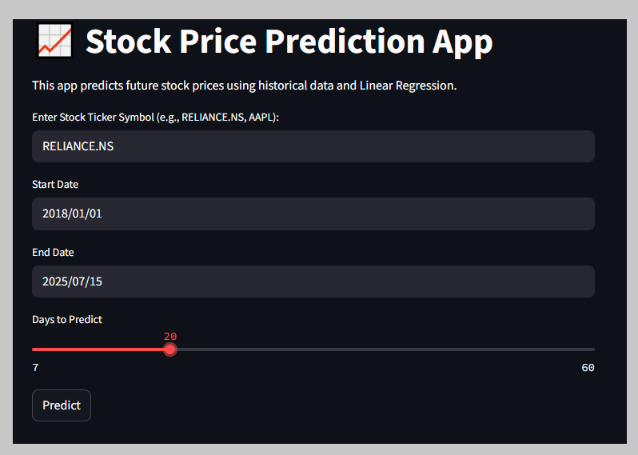

# 📈 Stock Price Predictor (Python + Streamlit)

A machine learning-powered web app that predicts future stock prices using historical data. Built using Python, Streamlit, and various ML libraries.

## 🚀 Features
- Fetches real-time stock data using `yfinance`
- Predicts future prices using regression models
- Clean and interactive Streamlit interface
- Visualizes trends and prediction graphs
- One-click run via `run_app.bat` (for Windows)

## 📂 Project Files

| File                | Description                          |
|---------------------|--------------------------------------|
| `app.py`            | Streamlit web app frontend           |
| `stock_predictor.py`| Core ML logic for prediction         |
| `requirements.txt`  | Python dependencies                  |
| `run_app.bat`       | Windows shortcut to launch app       |

---

## 🛠️ Technologies Used
- **Python 3.10+**
- **Pandas, NumPy**
- **Scikit-learn**
- **Matplotlib**
- **yfinance**
- **Streamlit**

---

## 📦 How to Run This App

### 1. Clone this repository
bash 
git clone https://github.com/Riteshkalkar/stock.git
cd stock

## 📸 Screenshot

## 🖥️ Live Demo
👉 [Click here to view the stock_price_prediction_app](https://wvfx6ieaj9usr2xyyvan3s.streamlit.app/)

